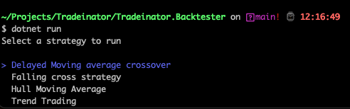
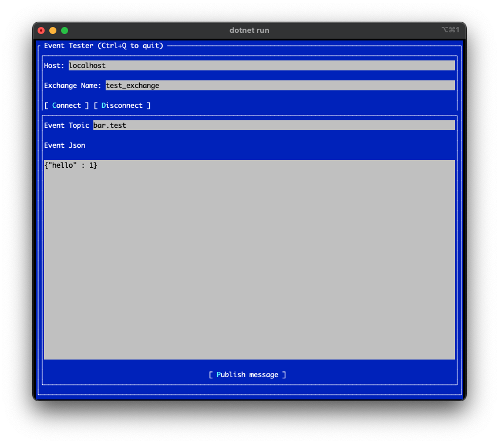

# Tradeinator

This is a project i have been wanting to work on for a while.

The aim of the project is to provide a modular approach to developing algorithmic trading systems.

The project utilises an event driven architecture and uses RabbitMQ as the message bus.

The use of an event driven architecture provides a modular approach to the system allowing me to 
add/remove/edit modules and strategies without having to stop and restart other systems

For stock indicators the following library is used: https://github.com/ooples/OoplesFinance.StockIndicators

## Strategy Research
Most of the strategy research is done on TradingView using Pinescript and then transferred to C#.


## Topics
Event topics should follow the general format of `{action}.{symbol}`

eg. `bar.AAPL` is the topic for a new Apple bar

## Adding new symbols
To add new symbols without having to stop and restart the system a file watcher is implemented
using the [.net file system watcher](https://learn.microsoft.com/en-us/dotnet/api/system.io.filesystemwatcher?view=net-8.0)
the `symbols.txt` file in the stocks/crypto `DataIngestion` project is watched.
The system has a file watcher registered to this file, when the file changes symbol subscriptions are added or removed

## Improvements
- strategy init message
- change console programs to worker services?
- add systemd service files to each project that can be easily copied
- solution level config file or a project that contains the config files and a class to load them

## Configuration
All config files are located in the `Tradeinator.Configuration` project.

This provides a central place for all config files and reduces the need to duplicate them across projects

The configuration is loaded as an IConfiguration from Microsoft.Extensions.Configuration and loads everything from the `appsettings.json` file and `.env` file

Configuration files are copied to the build directory.


An example of using the config loader
```csharp
using Tradeinator.Configuration;

// config is loaded
var config = new ConfigurationLoader();

// config can be accessed using indexing
config["Rabbit:Host"]; // will return the host from the appsettings.json file

// or with the .Get(string key) method
config.Get("Rabbit:Host"); // will return the same value as the index call

```


## Tradeinator.Listener
Provides a simple example of registering to an topic and consuming data

## Tradeinator.Backtester
Provides a framework for quickly backtesting strategies using a forked version of the `SimpleBackTestLib` library

Strategies inherit from the BacktestRunner abstract class and must have the BacktestStrategyMetadata attribute added for it to be discoverable.
The meta data attribute defines some properties of the strategy such as it's name and budget.

When running the backtest the assembly is scanned for all classes that have the attribute applied. 
Options are then displayed allowing you to select which backtest to run (see image below)



Spectre.Console is used to pretty print options to the console

## Tradeinator.Dashboard
A blazor server web application built with the Microsofts Fluent UI.

Will provides a dashboard showing account balances, trades and more

## Tradeinator.EventTester
A Terminal GUI program to connect to the exchange and easily send test events

Built with the `Terminal.Gui` library

## Tradeinator.DataIngestion.Shared
Contains the implementation of the file watching and subscription management

## Tradeinator.DataIngestion.Crypto
This is the entry point for all crypto data into the system.

Symbols to subscribe to are registered in the projects `symbols.txt` file

## Tradeinator.DataIngestion.Stocks
This is the entry point for all stock data into the system.

Symbols to subscribe to are registered in the projects `symbols.txt` file

## Tradeinator.DataIngestion.Forex
This is the entry point for all forex data into the system.

Data is fetched from Oanda, currently only 30 minute bars are supported.

Symbols to subscribe to are registered in the projects `symbols.txt` file


## Tradeinator.Shared
This project provides shared classes for the solution, such as the exchange implementations and some generic models

## Tradeinator.Notifications

This project implements a notification system using a discord bot,
it listens to all events with the `notification.*` topic and publishes the events to discord.

A notification is the `Tradeinator.Shared.SystemMessage` class.
When the SystemMessages priority is `Critical` then the notification will add an `@everyone` mention

---

## Tradeinator.Logger
**This project is not currently implemented**

This project will subscribe to all order events (topic key: `order.*`) and log them to a database

